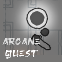

# Arcane Quest



Game made in Godot by me for the GitHub GameOff 2024.

> Embark on an epic quest to save the world from the clutches of evil! Dark forces are hunting down four ancient orbs, and whoever controls them will have the power to dominate the world. As the chosen hero, your mission is to track down these mysterious orbs before they fall into the wrong hands.
> Venture through treacherous lands, facing fierce monsters and collecting powerful weapons to aid you on your journey. With every step, you'll uncover secrets, battle evil creatures, and grow stronger. But beware—dark forces lurk around every corner, determined to stop you.
> Your ultimate goal is to collect the orbs, seal the evil forces away, and make a wish that will restore peace to the world. The fate of humanity lies in your hands—are you brave enough to take on this thrilling adventure and defeat the evil that threatens all?

> For those daring enough to take on the challenge, seek out the 99 hidden coins scattered throughout the game. Finding them won’t be easy, but the rewards are worth the effort. The world’s future is waiting for you to save it! 


```
Controls:

WASD or Arrow Keys to move around (Left Stick on Controller)
Space to interact with the environment (East Button on Controller)
Hold O to use the Bow (North Button on Controller)
Press Enter/Return to use the Sword (West Button on Controller)
Press B to drop bombs (South Button on Controller)
```
Credits:

```
Harsh Narayan Jha - Lead Developer, Game Design

Art Credits
Environment Art "Scribble Dungeons" by "kenney.nl" (CC0)
Pixel Art key by "Frontend Pashtet" on itch.io (CC0)
"monogram" font by "datagoblin" on itch.io
"Osake Font" by "dafonts.com"
"Spinning Pixel Art Coin" by "ThePeeps191" on itch.io
"Pixelarium UI" by "LukeThePolice" on itch.io

Audio/Music Credits
"Free RPG Music Pack" by "Shononoki" on itch.io
"Piano and Strings Music Pack" by "Innlydian" on itch.io
"Happy Loops" by "Goose Ninja" on itch.io
"RPG Music Pack" by JP Soundworks, Pack Published by Platonic Game Studio.
Various SFX by mixkit.io and pixabay.com

Addons/Scripts Credits
ProCam2D by Daz. B Like
Dialogue Manager by Nathan Hoad
Scene Manager by GlassBrick
ScriptIDE by "Maran23"
Some snippets from "Make a 2D Action RPG in Godot 4" series on YouTube by "Michael Game"

And the rest whom I forgot...

Made in Godot Engine (Open Source)

Concept by Harsh Narayan Jha
Originally Made for the GitHub GameOff 2024 on itch.io

Thanks for Playing Arcane Quest
Enjoy! 
```
