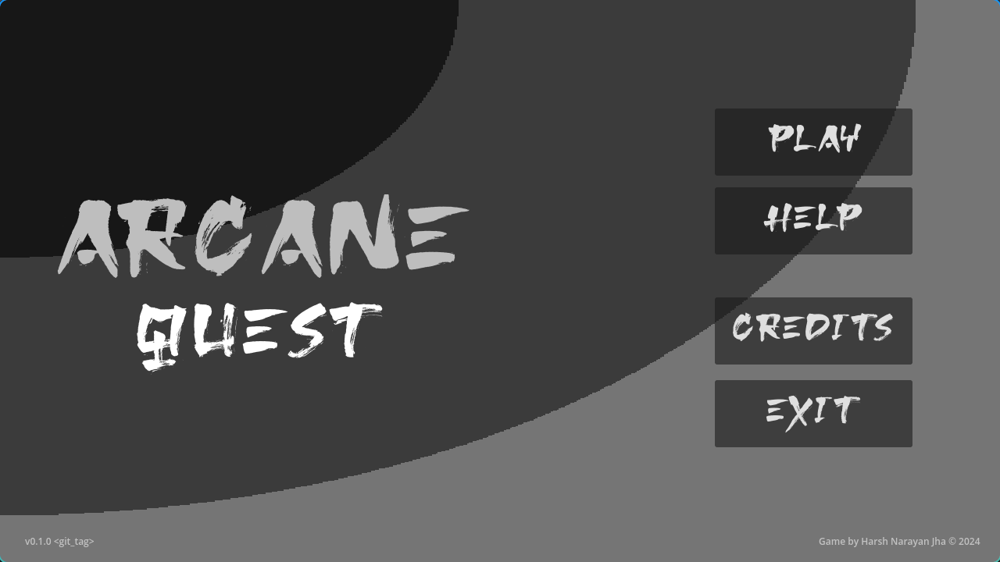

# Arcane Quest


Game made in Godot by me for the GitHub GameOff 2024.

> Play this game to save the world from the wishes of the evil.
> Some evil forces are trying to get hold of 4 mysterious orbs
> that will let them control the world.
> You must save the world by collecting the orbs and making a wish.



```
Controls:

WASD or Arrow Keys to move around (Left Stick on Controller)
Space to interact with the environment (East Button on Controller)
Hold O to use the Bow (North Button on Controller)
Press Enter/Return to use the Sword (West Button on Controller)
Press B to drop bombs (South Button on Controller)
```
Credits:

```
Harsh Narayan Jha - Lead Developer, Game Design

Art Credits
Environment Art "Scribble Dungeons" by "kenney.nl" (CC0)
Pixel Art key by "Frontend Pashtet" on itch.io (CC0)
"monogram" font by "datagoblin" on itch.io
"Osake Font" by "dafonts.com"
"Spinning Pixel Art Coin" by "ThePeeps191" on itch.io
"Pixelarium UI" by "LukeThePolice" on itch.io

Audio/Music Credits
"Free RPG Music Pack" by "Shononoki" on itch.io
"Piano and Strings Music Pack" by "Innlydian" on itch.io
"Happy Loops" by "Goose Ninja" on itch.io
"RPG Music Pack" by JP Soundworks, Pack Published by Platonic Game Studio.
Various SFX by mixkit.io and pixabay.com

Addons/Scripts Credits
ProCam2D by Daz. B Like
Dialogue Manager by Nathan Hoad
Scene Manager by GlassBrick
Some snippets from "Make a 2D Action RPG in Godot 4" series on YouTube by "Michael Game"

And the rest whom I forgot...

Made in Godot Engine (Open Source)

Concept by Harsh Narayan Jha
Originally Made for the GitHub GameOff 2024 on itch.io

Thanks for Playing Arcane Quest
Enjoy! 
```
